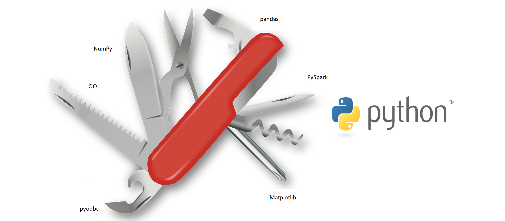

```{r setup, include=FALSE}
knitr::opts_chunk$set(echo = FALSE)
```

## So you want to learn R...

{width=250px}

  - Data analysis
  - Statistics
  - Scripting
  - Machine learning
  - Publication-grade figures
  - Web application
  - I was told I should

## So many languages

<div class="columns-2">

  - There are more than 200 programming languages
  - The tiobe index keeps track of popularity: <https://tiobe.com/tiobe-index/>

{width=400px}
</div>

## Language choice depends on purpose


## Python, R's closest competition

{width=800px}

## R, more than a language

<div class="columns-2">

- Incredibly rich ecosystem
- Strong community
- Industry support
- #1 for bioinformatics

{width=400px}

</div>

## CRAN

{width=800px}

## Are all of them useful for you?

```{r, message=FALSE, echo=TRUE}
library(cowsay)
cat(say("R is the best", by = "hypnotoad", type = "string"))
```


## Bioconductor

<div style = "position:absolute;
      top: 250px;
      left: 250px;
      z-index: 2;">
{width=200px}
</div>

```{r, echo=FALSE, message=FALSE, warning=FALSE}
library(rvest)
library(ggplot2)
bioc_pkgs <- read_html("https://en.wikipedia.org/wiki/Bioconductor")
bioc_pkgs_tbl <- html_nodes(bioc_pkgs, "table")[[2]] %>%
  html_table()
# A kludge to get version numbers properly ordered
bioc_pkgs_tbl$Version[bioc_pkgs_tbl$Version == 1] <- "1.0"
bioc_pkgs_tbl$Version[bioc_pkgs_tbl$Version == 2] <- "2.0"
bioc_pkgs_tbl$Version[bioc_pkgs_tbl$Version == 3] <- "3.0"
bioc_pkgs_tbl$Version[bioc_pkgs_tbl$Version == 2.1] <- c("2.1", "2.10")
bioc_pkgs_tbl$Version <- factor(
    bioc_pkgs_tbl$Version,
    levels = rev(unique(bioc_pkgs_tbl$Version)))
ggplot(aes(x = Version, y = `Package Count`), data = bioc_pkgs_tbl) + 
  geom_point(size = 3.5) + 
  ggtitle("Number of software packages in Bioconductor releases") + 
  theme_bw(base_size = 14) + 
  theme(axis.text.x = element_text(angle = 45, vjust = 0.5))
```

</div>

## Why some people don't like R

<div class="columns-2">

  - flexibility comes at a cost
  - overwhelming choice 
  - dozens of ways for solving a task
  - easy to write bad and inefficient code
  - mixing work-flows, inconsistencies
  - not a clean language


</div>

## Agenda

  - 08.30 - 09.00 Introduction 
  - 09.00 - 10.00 R data handling basics - tidyverse, bioconductor
  - 10.00 - 10.15 Coffee break
  - 10.15 - 12.00 Writing your own R package 
  - 12.00 - 13.00 Lunch break
  - 13.00 - 14.45 Epigenomic data analysis with DeepBlueR
  - 14.45 - 15.00 Coffee break
  - 15.00 - 16.30 Interactive web application with R shiny
  - 16.30 - 17.00 Wrap-up and discussion


## Learning Goals

<div class="columns-2">

  - Get familiar with basic concepts in R
  - Learn how to get help
  - Learn what is possible
  - Learn how R can be useful for your research
  - Play and loose fear


</div>


## Parallelization

  - speedup for long computations
  - many ways
    - parallel, snow, multicore, ...
    - foreach supports various mechanisms via %dopar%
    - mcapply
    - BiocParallel
    - ...

## Cloud computing

  - with R you can submit a long-running analysis as a job to a server
  - e.g. slurm, sun grid engine, ...

## Simple data types in R

- number: integer, float
- character: strings, texts
- factor: categories
- logical: TRUE / FALSE

```{r, echo = TRUE}
an_int <- 5
a_vector_with_ints <- c(1, 2, 3, 4, 5)
a_vector_with_ints <- seq(1, 5, by = 1)

a_float <- 0.1
a_vector_with_floats <- c(0.1, 0.2, 0.3, 0.4, 0.5)
a_vector_with_floats <- seq(0.1, 0.5, by = 0.1)

a_string <- "R is great"
a_vector_of_strings <- c(a_string, ", isnt't it?")
cat(paste0(a_vector_of_strings, collapse = ""))
```

## Be careful with factors

```{r, echo = TRUE}
a_vector <- c("disease", "disease", "control", "control")
a_factor <- as.factor(a_vector)
a_factor

another_vector <- c(1,0,1,0)
another_factor <- as.factor(another_vector)
as.integer(another_factor)
as.integer(as.character(another_factor))
```

## Data structures in R

Tables:

  - data.frame: many vectors make a table
  - matrix: every element has the same type

More efficient implementations of tables:

  - tibble (tidyverse)
  - data.table (data.table)

## Data structures in R contd

Lists:

  - not the same as a vector, can contain anything
  - lists of lists
  - lists of data.frame
  - list of objects (e.g. Bioconductor ExpressionSet)
  - ...
  
```{r, echo = TRUE}
a_vector <- c(0, 1, 2, 3)
a_list <- list(0, 1, 2, 3)
```

## Functions

- have a name
- take any number of (named) input parameters
- return one output of any type

```{r, echo = TRUE, eval = FALSE}
add_to_five <- function(add_me){
  return(5 + add_me)
}

```

## Final proof that R is crazy
```{r, echo = TRUE}

#DON'T EVER DO THIS
'+' <- function(a, b){
  return(a - b)
}

5 + 4

rm('+') #clean up
```

## Passthrough

Functions can pass input they don't need

```{r, echo = TRUE}
add <- function(a, b){ a + b }

add_to_five <- function(...) add(5, ...)

add_to_five(7)
```

 
## Missing values - NA

```{r, echo = TRUE}
a <- c(5, 6, 9, 1, NA, 5)

mean(a) #wrong
mean(na.omit(a)) #better
mean(a, na.rm = TRUE) #best

```

## Special numbers


```{r, echo=TRUE}
4/0
0/0
log2(0)
```

## if clauses

```{r, echo = TRUE}
R_is_great <- TRUE
if(R_is_great)
{ 
  cat("I know!") 
} else {
  cat("Liar!")
} 
```


## Loops

```{r, echo = TRUE}
for(i in 1:10) cat("R is great!")
for(i in seq_len(10)) cat("this is better")
for(i in c("stupid", "okay", "great")) cat("R is", i, "!")
```

## Apply

- lapply over lists
- apply(x, margin) where x is a matrix, 
- margin is either 1 for rows or 2 for columns

```{r, echo = TRUE}
lapply(list("ok", "horrible", "great"), function(x) return(paste("R is", x, "!")))
```

```{r cars, echo = TRUE}
cars
cars_matrix <- as.matrix(cars)

apply(cars_matrix, 1, function(x){ x[1] * x[2]})
apply(cars_matrix, 2, sum)
```

## Foreach

A powerful loop implementation

```{r, echo = TRUE}
library(foreach)
foreach(i = 1:2) %do% { i * 2 }
foreach(i = 1:10, .combine = sum) %do% {  i }
```

  
