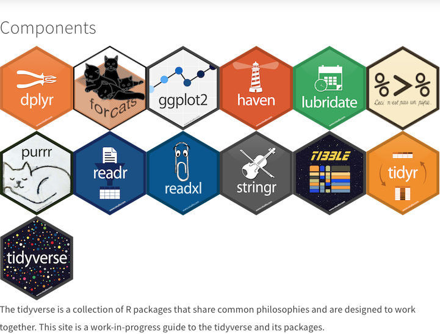

```{r setup, include=FALSE}
knitr::opts_chunk$set(echo = FALSE)
```

## What is the tidyverse


```{r, eval=FALSE, echo=TRUE}
install.packages("tidyverse")
```

{width=600px}

## Reading data

Read tables from flat files:

- read_csv : comma separated
- read_csv2: semicolon separated
- read_tsv : tab separated

```{r, echo=TRUE, warning=FALSE, message=FALSE}
library(readr)
TTP_meth <- read_tsv(file = "TTP_methylation.csv")
```

```{r, echo = FALSE}
library(magrittr)
kableExtra::kable(TTP_meth) %>% kableExtra::kable_styling()
```

## R can read excel files as well

```{r, echo=TRUE, message = FALSE, warning = FALSE}
library(readxl)
gbm_clin_rad <- read_xlsx("gbm_clinical_radiation.xlsx")
```

```{r, echo = FALSE}
kableExtra::kable(gbm_clin_rad) %>% kableExtra::kable_styling()
```

## dplyr and magrittr

 - dplyr implements a vocabulary for data manipulation
 - magrittr has %>%, the pipe operator

```{r}
cars %>% apply(2, sum)
apply(cars, 2, sum)
```

## dplyr - filter, select

```{r}
gbm_clin_rad %>% 
   filter(radiation_type == "EXTERNAL BEAM", 
          days_to_radiation_therapy_start > 10) %>%
   select(bcr_patient_barcode, radiation_dosage)
```

## dplyr - group_by and summarize

```{r}
gbm_clin_rad %>% 
   group_by(anatomic_treatment_site) %>% 
   summarise(mean_rad = mean(radiation_dosage, na.rm = TRUE), n = n())
```

## dplyr - mutate

```{r}
gbm_clin_rad %>% 
   mutate(months_to_radiation = days_to_radiation_therapy_start / 30.5) %>%
   select(bcr_patient_barcode, months_to_radiation)
```


## Tidy data

 - Each variable has its own column.
 - Each observation has its own row.
 - Each value has its own cell.

## Example

```{r, message=FALSE, echo = FALSE, warning=FALSE}
library(tidyr)
kableExtra::kable(billboard[1:10,1:10])
```

## tidyr package

```{r, echo = TRUE}
library(tidyr)
billboard %>%
 pivot_longer(
   cols = starts_with("wk"),
   names_to = "week",
   names_prefix = "wk",
   values_to = "rank",
   values_drop_na = TRUE
 ) %>% head()
```

## The grammar of graphics - ggplot2

- build figures in a layered fashion from tidy data


## Challenge 1

  - Read the gbm dataset
  - Filter for regimen_indicat... ADJUVANT
  - group_by anaotmic_treatm...
  - summarize the median dosage

## Challenge 2

You receive expression data from a collaborator. They tell you:

 - Exiqon miRNA array
 - 3 replicates per experiment
 - ordinary MCF7 are compared to PFC overexpressing cells
 - PFC expression is inducible
 - Task 1: tidy up the data using pivot_longer
 - Task 2: ggplot2 the miRNA expression values
 - Task 3: which miRNAs are differentially expressed (t-test)
